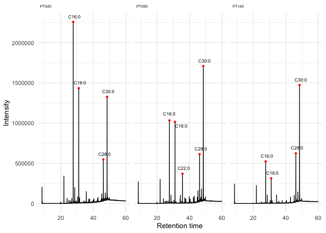

```r
library(tidyverse)
# from LiYingSed2020_GCMS_TIC.CSV, before methyl, just silylation
df <- read_csv("https://docs.google.com/spreadsheets/d/e/2PACX-1vTI_5zJpN_dywxtdFBKtON89jKXTzJencesAWjtO9yDZ4_LljkiLu9_EkP9XeIF8VrQxS2H_iU1ZnC4/pub?output=csv")
ixd <- which(str_detect(df$Path, "D"))
dfs <- split(df, cumsum(1:nrow(df) %in% ixd))
dfs_data <- dfs[c(FALSE, TRUE)]
dfs_name <- dfs[c(TRUE, FALSE)]
names(dfs_data) <- map(dfs_data, ~.x$Path[1])
names(dfs_name) <- map(dfs_name, ~.x$Sample[1])
dfs <- map_df(dfs_data, ~.x[-1, ] %>% 
              mutate_all(as.numeric), 
              .id = 'sample')
```


```r
# get sample number
dfs <- 
  dfs %>% 
  mutate(sample = str_extract(sample, pattern = "_00[0-9]")) %>% 
  mutate(Sample = case_when(sample == "_002" ~ substr(names(dfs_name)[1], start = 1, stop = 5),
                            sample == "_003" ~ substr(names(dfs_name)[2], start = 1, stop = 5),
                            sample == "_004" ~ substr(names(dfs_name)[3], start = 1, stop = 5),
                            sample == "_005" ~ substr(names(dfs_name)[4], start = 1, stop = 5),
                            sample == "_006" ~ substr(names(dfs_name)[5], start = 1, stop = 5),
                            sample == "_007" ~ substr(names(dfs_name)[6], start = 1, stop = 5),
                            sample == "_008" ~ substr(names(dfs_name)[7], start = 1, stop = 5),
                            sample == "_009" ~ substr(names(dfs_name)[8], start = 1, stop = 5)))
```


```r
ggplot(dfs,
       aes(Path, File)) +
  geom_line() +
  labs(x = "Retention time",
       y = "Intensity",
       title = names(dfs[1])) +
  theme_minimal() +
  facet_wrap(~Sample)
```

<!-- -->


```r
# select interested layers
interest <- 
  dfs %>% 
  filter(Sample == c("PT095", "PT145"))

highlight_df <- 
  interest %>% 
  filter(File >= 200000) %>% 
  mutate(fatty = round(Path)) %>% 
  group_by(Sample, fatty) %>% 
  arrange(desc(File)) %>% 
  distinct(fatty, .keep_all = TRUE) %>% 
  filter (!fatty %in% c(49, 29, 22, 8)) %>% 
  mutate(fatty_label = case_when(fatty == 28 ~ "C16:0", #Palmatic
                                 fatty == 31 ~ "C18:0", #Stearic
                                 #fatty == 22 ~ "Myristic",
                                 fatty == 36 ~ "C22:0", #Behenic
                                 fatty == 46 ~ "C28:0", #Montanic
                                 fatty == 48 ~ "C30:0")) #Melissic

ggplot(interest,
       aes(Path, File)) +
  geom_line() +
  geom_point(data = highlight_df, aes(Path, File), color="red", size=1) +
  ggrepel::geom_text_repel(data = highlight_df, 
                           aes(label = fatty_label),
                           size = 2.5,
                           vjust = -1.2, 
                           hjust = 0.4,
                           show.legend = FALSE) +
  labs(x = "Retention time",
       y = "Intensity") +
       #title = names(dfs[1]))
  theme_minimal() +
  facet_wrap(~Sample, ncol = 3) +
  theme(strip.text.x = element_text(vjust = 3,
                                    hjust = 0,
                                    size = 6))
```

<!-- -->
